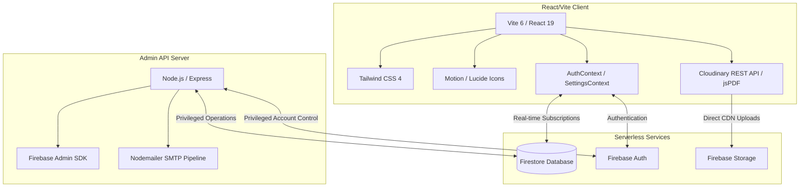

# Kingdom Alliance — Architectural Blueprint

Welcome to the comprehensive architectural blueprint for **Kingdom Alliance**, a high-end, premium Christian matrimonial platform designed to facilitate meaningful connections rooted in faith and values. 

This document maps out the system architecture, directory structures, Firestore database schemas, state management contexts, custom backend systems, and authorization rules governing the entire platform.

---

## 1. Technical Stack Overview

Kingdom Alliance uses a modern, robust, and highly reactive technical stack engineered for extreme responsiveness, visually premium styling, and robust cloud services:



### Frontend (React/Vite/Tailwind)
*   **Core UI Library:** **React 19** (concurrent rendering, modern state features).
*   **Build Toolchain:** **Vite 6** & **TypeScript 5.8** (lightning-fast Hot Module Replacement, optimized build tree-shaking).
*   **Styling Engine:** **Tailwind CSS v4.0** with `@tailwindcss/vite` compiler hooks (fluid grid systems, deep aesthetic glassmorphism, dynamic animations).
*   **Animations:** **Motion** (v12 for fluid state transitions, dynamic card sliders, micro-interactions).
*   **Visual Assets:** **Lucide React** icons paired with dynamic custom branding elements.

### Infrastructure & Serverless
*   **Authentication:** **Firebase Authentication** (email/password credentials, custom administrative elevation claims, real-time subscriber channels).
*   **Real-time Database:** **Cloud Firestore** (highly scaling document-oriented NoSQL database with granular real-time sync listeners).
*   **Binary/Image Storage:** **Firebase Storage** (secure asset bucket backups) combined with **Cloudinary CDN** (direct client-side unsigned REST API uploads for fast gallery loading, custom size transformations, and manual SHA-1 cryptographic delete signatures).
*   **AI Integration:** **Gemini Gen AI SDK (`@google/genai`)** (integrated to assist in smart profile creation, bio enhancements, and automated verification checks).
*   **File Exports:** **jsPDF** & **jsPDF-AutoTable** (converts Firestore user attributes into high-end downloadable Christian Matrimonial Biodata sheets).

### Backend (Node.js/Express)
*   **Core App Server:** **Node.js with Express 4** (running on port `3001` or custom ports, separate from the Vite client dev server on port `3000`).
*   **Privileged Operations:** **Firebase Admin SDK 12** (bypasses standard frontend sandbox constraints, enabling secure transactions, clean cascading deletes, and custom token claims).
*   **SMTP Mail Engine:** **Nodemailer 8** (fully loaded custom SMTP transport pipelines supporting secure TLS authentication, beautiful HTML branding compilation, and fallback simulator logging).

---

## 2. Core Directory Structure

The project directory is split into a client-side codebase (`/src`) and an administration-privileged server (`/server`):

```
kingdom-alliance/
├── firestore.rules          # Granular security gates & role-based validation routines
├── vite.config.ts           # Vite server definitions, ports, and Tailwind CSS compile hooks
├── package.json             # Core frontend build configurations & library dependencies
├── server/                  # Admin-privileged Node.js service
│   ├── config/
│   │   └── mailer.js        # Nodemailer SMTP configurations & HTML transactional layouts
│   ├── index.js             # Express API server, Auth middleware, 6-stage delete pipeline
│   ├── serviceAccountKey.json # High-privileged Firebase credentials key (git-ignored)
│   ├── package.json         # Server-side package manager and runtime dependencies
│   ├── makeAdmin.js         # Script helper to elevate a UID to administrator status
│   └── purgeGhosts.js       # Utility to remove orphan auth files or dead records
└── src/                     # React Single Page Application (SPA)
    ├── main.tsx             # Root document loader and renderer hook
    ├── App.tsx              # Application Routing Map and Layout boundaries
    ├── index.css            # Root Tailwind style variables, custom font maps
    ├── config.ts            # Global static configuration overrides, theme branding hexes
    ├── components/          # Shared components
    │   ├── AuthGuard.tsx    # Multi-state access router (protects membership status)
    │   ├── Layout.tsx       # Sidebar, Header, Notification Center, and fluid wrapper
    │   ├── KingdomCrossIcon.tsx # Specialized SVG brand identifier
    │   └── admin/
    │       ├── AdminReportModal.tsx # Displays user reports and profile violations
    │       └── AdminUserDetailModal.tsx # Detailed admin overview for profile edits
    ├── lib/                 # Shared libraries, utilities, and context providers
    │   ├── AuthContext.tsx  # Auth state channel (exposes profile status, refresh token)
    │   ├── SettingsContext.tsx # Listens for site branding adjustments in Firestore
    │   ├── firebase.ts      # Client Firebase initialization and error mapper
    │   ├── cloudinary.ts    # REST endpoints, compression helpers, SHA-1 calculators
    │   ├── email.ts         # User welcome, verification, and OTP simulator pipelines
    │   ├── BiodataGenerator.ts # PDF engine utilizing jsPDF layout blocks
    │   └── utils.ts         # Distance score, dates, matching scores, status normalizers
    ├── pages/               # Functional view screens
    │   ├── LandingPage.tsx  # Dynamic marketing screen
    │   ├── LoginPage.tsx    # Standard subscriber email auth screen
    │   ├── RegisterPage.tsx # Form validations, basic profile creators
    │   ├── OnboardingPage.tsx # Multi-step Christian biographical catalog (100k line module)
    │   ├── DashboardPage.tsx # Match widgets, notification center, and custom metrics
    │   ├── MatchesPage.tsx   # Premium card layout discovery and age/denomination search
    │   ├── MessagesPage.tsx  # Real-time private chat channels
    │   ├── ProfilePage.tsx   # Biodata displays, gallery viewers, print engines
    │   ├── ShortlistsPage.tsx # Shortlisted member tracking
    │   ├── InterestsPage.tsx # Sent and received matrimonial faith indicators
    │   ├── status/          # Informational status lock screens
    │   │   ├── PendingApprovalPage.tsx # Displayed while admins verify profile onboarding
    │   │   ├── SuspendedPage.tsx # Temporarily locked out accounts
    │   │   ├── BannedPage.tsx    # Permanently locked out accounts
    │   │   └── RejectedPage.tsx  # Instructs rejected registrations on how to adjust details
    │   └── admin/           # Administrative Dashboards
    │       ├── AdminDashboard.tsx # Overview statistics, total count meters, operations
    │       ├── AdminLoginPage.tsx # Secure admin auth gate
    │       ├── AdminApprovals.tsx # Profile approval work queue
    │       ├── AdminPhotos.tsx    # Media moderation and manual photo audits
    │       ├── AdminUserManagement.tsx # Advanced user operations (bans, deletes)
    │       └── RejectedProfilesPage.tsx # Archive of previously declined registrations
    └── services/
        └── authService.ts   # Axios endpoints and configuration wrappers
```

---

## 3. Database Schema (Firestore Collections)

Firestore collections are governed by robust validation rules in `firestore.rules` preventing unauthorized schema insertions:

```
                  ┌──────────────────────┐
                  │       settings       │
                  │   ("site_config")    │
                  └──────────────────────┘
                             │
                             ▼
┌──────────────┐  ┌──────────────────────┐  ┌──────────────┐
│    admins    │  │        users         │  │ shortlists   │
│  {adminUid}  │  │      {userUid}       │  │ {shortlistId}│
└──────────────┘  └──────────────────────┘  └──────────────┘
                             │ (sub-coll)
                             ▼
                  ┌──────────────────────┐
                  │    notifications     │ (embedded map)
                  └──────────────────────┘
                             │
     ┌───────────────────────┼───────────────────────┐
     ▼                       ▼                       ▼
┌──────────────┐  ┌──────────────────────┐  ┌────────────────┐
│  interests   │  │        chats         │  │photoModeration │
│ {interestId} │  │ {userUid1_userUid2}  │  │   {docId}      │
└──────────────┘  └──────────────────────┘  └────────────────┘
                             │
                             ▼ (sub-coll)
                  ┌──────────────────────┐
                  │       messages       │
                  │     {messageId}      │
                  └──────────────────────┘
```

### 1. `users` Collection
Contains full demographic, religious, biographical, preference, and status details of members.
*   **Document ID:** User’s Auth UID (`{userUid}`).
*   **Data Model / Fields:**
    ```typescript
    interface UserProfile {
      uid: string;                    // Primary key matching Firebase Auth UID
      email: string;                  // User email address
      name: string;                   // Member's displayed name
      gender: 'male' | 'female' | ''; // Profile gender designation
      profileType: 'bride' | 'groom'; // Primary target category
      age: number;                    // Validator limits (18 - 100)
      height: number;                 // Metric height in cm (0 - 300)
      location: string;               // Location string (e.g. Riyadh, Saudi Arabia)
      denomination: string;           // Christian denomination (Protestant, Catholic, Orthodox)
      church: string;                 // Home church/parish name
      education: string;              // Highest degree attained
      profession: string;             // Member's job title / industry
      mobileNumber: string;           // E.g., "+966 55 123 4567"
      aboutMe: string;                // Free-text biographical details (<= 2000 chars)
      familyDetails: string;          // Family details & background (<= 2000 chars)
      partnerPreferences: {           // Embedded Map for matching scoring algorithms
        ageMin: number;
        ageMax: number;
        heightMin: number;
        heightMax: number;
        location?: string;
        denomination?: string;
      };
      photoUrl: string;               // CDN URL of the active, approved profile photo
      pendingPhotoUrl: string;        // A newly uploaded profile photo awaiting admin review
      photoStatus: 'idle' | 'pending' | 'approved' | 'rejected';
      photoPrivacy: 'public' | 'accepted_only';
      photoRejectionReason: string;   // Reason specified by admin in case of rejection
      approvalStatus: 'incomplete' | 'pending' | 'approved' | 'rejected';
      isApproved: boolean;            // Master gateway toggle for search discovery
      status: 'active' | 'inactive' | 'suspended' | 'banned'; // System visibility status
      onboardingComplete: boolean;    // Flag indicating completed biographical setup
      gallery: Array<{                // Additional album uploads
        id: string;
        url: string;
        status: 'pending' | 'approved' | 'rejected';
        uploadedAt: any;              // Timestamp
        rejectionReason?: string;
      }>;
      notifications: Array<{          // Local embedded notification log
        id: string;
        title: string;
        message: string;
        type: 'success' | 'alert' | 'info';
        read: boolean;
        createdAt: string;            // ISO String
      }>;
      createdAt: any;                 // Firestore Timestamp
      updatedAt: any;                 // Firestore Timestamp
      lastLoginAt?: any;              // Firestore Timestamp updated on session startup
    }
    ```

### 2. `interests` Collection
Tracks sent, received, and mutual matrimonial faith proposals.
*   **Document ID:** Auto-generated ID (`{interestId}`) or custom hash.
*   **Data Model / Fields:**
    ```typescript
    interface Interest {
      fromId: string;                 // UID of the sender (initiator)
      toId: string;                   // UID of the recipient
      status: 'pending' | 'accepted' | 'declined';
      createdAt: any;                 // Firestore server timestamp
    }
    ```

### 3. `shortlists` Collection
Tracks members saved/bookmarked for later review.
*   **Document ID:** Auto-generated ID (`{shortlistId}`).
*   **Data Model / Fields:**
    ```typescript
    interface Shortlist {
      userId: string;                 // UID of the shortlisting member
      targetId: string;               // UID of the saved profile
      createdAt: any;                 // Firestore server timestamp
    }
    ```

### 4. `chats` Collection
Contains conversation summaries and matches.
*   **Document ID:** Alphabetically sorted list of UIDs connected with an underscore (`{userUid1_userUid2}`).
*   **Sub-collection: `messages`**
    Tracks real-time message exchange logs:
    ```typescript
    interface Message {
      chatId: string;                 // Matches parent Chat Document ID
      senderId: string;               // Sender Auth UID
      receiverId: string;             // Recipient Auth UID
      text: string;                   // The message text (<= 5000 characters)
      read: boolean;                  // Unread count flag
      createdAt: any;                 // Server timestamp
    }
    ```

### 5. `photoModeration` Collection
The administrative queue for photo reviews (audited securely by Node API server).
*   **Document ID:** Generated ID or tied directly to specific photo ID (`{docId}`).
*   **Data Model / Fields:**
    ```typescript
    interface PhotoModerationRecord {
      uid: string;                    // UID of the user who uploaded the photo
      userName: string;               // User display name
      photoURL: string;               // CDN image link
      photoType: 'profilePhoto' | 'galleryPhoto';
      galleryPosition: number | null; // Index if photoType is 'galleryPhoto'
      status: 'approved' | 'rejected'; // State decision
      uploadedAt: any;                // Upload date timestamp
      reviewedAt: any;                // Review date timestamp
      reviewedBy: string;             // UID of the reviewing administrator
      rejectedReason?: string;        // Admin reason (required if status is 'rejected')
    }
    ```

### 6. `settings` Collection
Global configuration settings.
*   **Document ID:** Single master document named `site_config`.
*   **Data Model / Fields:**
    ```typescript
    interface SiteSettings {
      siteName: string;               // Brand title (e.g. "Kingdom Alliance")
      siteTagline: string;            // Matrimonial slogan
      supportEmail: string;           // Admin support email
      supportPhone: string;           // Support phone number (e.g. KSA based)
      primaryColor: string;           // Customizable branding theme color (Hex code)
      secondaryColor: string;         // Secondary branding shade (Hex code)
      enableChat: boolean;            // Master chat toggle
      enableNotifications: boolean;   // Notifications toggle
      requireAdminApproval: boolean;  // Lock gate toggle requiring signup audits
      minAge: number;                 // Age limit constraint
      cloudinaryCloudName: string;    // Cloudinary details (synced real-time)
      cloudinaryUploadPreset: string; // Cloudinary upload bucket preset
    }
    ```

### 7. `admins` Collection
Identifies elevated users who bypass matrimonial filters and gain access to the control panels.
*   **Document ID:** User’s Auth UID (`{adminUid}`).
*   **Data Model / Fields:**
    ```typescript
    interface AdminRecord {
      uid: string;
      email: string;
    }
    ```

---

## 4. State Management & Contexts

Kingdom Alliance prioritizes a robust, reactive state management system designed around React Contexts and real-time Firestore listeners:

### `AuthContext` (`src/lib/AuthContext.tsx`)
Provides reactive access to current Firebase Auth user credentials, Firestore profile data, and administrative authorization claims:
*   **Real-time Synchronization:** On load, subscribes to an `onAuthStateChanged` Firebase Auth observer.
*   **Profile Bootstrapping:** Automatically pulls the user's `/users/{uid}` document, updating the state whenever onboarding edits are committed.
*   **Admin Claim Validation:** Scans the `/admins/{uid}` collection to set the `isAdmin` boolean flag.
*   **Automatic Administrator Elevation:** Contains bootstrap rules matching allowed developer emails (e.g., `md.imranabid@gmail.com`, `admin@kingdomalliance.com`, `gsmtp22@gmail.com`) to write privileged admin credentials into Firestore automatically.
*   **Login Auditing:** Monitors login timestamps, dynamically updating user state to `'active'` in Firestore if they log back in after being inactive.

### `SettingsContext` (`src/lib/SettingsContext.tsx`)
Exposes global visual settings and functional toggles across the entire application:
*   **Real-time Styling Sync:** Subscribes to the `/settings/site_config` document.
*   **Dynamic Custom Themes:** When an administrator updates the primary or secondary branding colors in the Admin Panel, `SettingsContext` catches the Firestore snapshot update and dynamically injects the new colors as CSS custom variables directly into the document root:
    ```javascript
    document.documentElement.style.setProperty('--primary', data.primaryColor);
    document.documentElement.style.setProperty('--secondary', data.secondaryColor);
    ```
*   **Browser Title Tuning:** Automatically adjusts `document.title` to match the custom `siteName` from Firestore configurations.

---

## 5. Backend & Custom External Services

To maintain a secure workspace and bypass standard sandbox limits, Kingdom Alliance implements a dedicated Express microservice communicating with frontend APIs:

### 1. Custom Node/Express Server (`/server/index.js`)
*   **Security Controls:** Whitelists specific origins (`localhost:3000`, `localhost:5173`) and checks incoming administrator requests via an **Authorization Token Verification Middleware** (`requireAdminAuth`).
*   **Privileged Custom Actions:**
    *   **6-Stage Cascading Deletion (`POST /api/admin/delete-user`):** Initiates a secure cascading delete protocol to prevent orphan records or "ghost" data:
        1. **Stage A:** Deletes the user profile directly from Firebase Authentication.
        2. **Stage B:** Removes the primary `/users/{uid}` document.
        3. **Stage C:** Deletes all `/photoModeration` entries matching the target UID.
        4. **Stage D:** Clears all `/interests` documents where `fromId == uid` or `toId == uid`.
        5. **Stage E:** Clears all `/shortlists` records where `userId == uid` or `targetId == uid`.
        6. **Stage F:** Recursively purges all messages inside nested `/chats/{chatId}/messages` sub-collections, then deletes the parent chat document.
    *   **Photo Approval Transaction (`POST /api/admin/approve-photo`):** Atomically writes photo approval statuses, shifts pending uploads, appends success notifications to the user profile, and triggers SMTP emails.
    *   **Photo Rejection Transaction (`POST /api/admin/reject-photo`):** Logs rejection reasons, blurs the primary layout, appends warning notifications to the user profile, and triggers SMTP warning emails.

### 2. Nodemailer SMTP Mail Service (`/server/config/mailer.js`)
*   **SMTP Authentication:** Loads configuration variables from `.env` (SSL/TLS support, GMAIL SMTP integration). Supports a simulated log mode if credentials aren't set.
*   **Automated Email Notification Pipelines:**
    *   `sendProfilePhotoApprovalEmail(email, name)` -> Sends branded profile photo approval emails.
    *   `sendProfilePhotoRejectionEmail(email, name, reason)` -> Alerts users of rejected profile photos, advising them to re-upload.
    *   `sendGalleryPhotoApprovalEmail(email, name)` -> Notifies users when a gallery photo passes review.
    *   `sendGalleryPhotoRejectionEmail(email, name, reason)` -> Alerts users of declined gallery photos without affecting main account standing.

### 3. Frontend Utility Bridges (`/src/lib/`)
*   **Cloudinary SDK Wrapper (`cloudinary.ts`):** Handles image compression using `browser-image-compression` and executes direct unsigned REST API uploads to Cloudinary. It also generates secure SHA-1 deletion signatures on demand to safely delete rejected images from CDN servers.
*   **EmailJS client fallback (`email.ts`):** Client-side backup option to send welcome or OTP verification emails.
*   **PDF Biodata Engine (`BiodataGenerator.ts`):** Client-side exporter using `jspdf` and `jspdf-autotable`. Converts structured database values into a beautiful printable/downloadable Christian Matrimonial Biodata sheet.

---

## 6. Routing, Navigation & Access Gates

Protected routing is governed by React Router and double-checked by the multi-state `AuthGuard`:

```
[Public Visitor] 
    │
    ├───► / (LandingPage)
    ├───► /login (LoginPage)
    └───► /register (RegisterPage)
           │
           ▼
     [Authenticated User]
           │
           ├─► Email Verified? ── NO ──► /register (Resend Link)
           │
           ├─► Onboarding Complete? ── NO ──► /onboarding (OnboardingPage)
           │
           ├─► Admin Status? ── YES ──► Bypass checks ──► /admin (Admin Panel)
           │
           ▼
     [Account State Review]
           │
           ├─► approvalStatus == 'pending'  ──► /waiting-room (PendingApprovalPage)
           ├─► status == 'suspended'        ──► /suspended (SuspendedPage)
           ├─► status == 'banned'           ──► /banned (BannedPage)
           ├─► status == 'rejected'         ──► /rejected (RejectedPage)
           │
           ▼ (ALL PASS)
     [Approved Member Access] ──► Render Layout (Sidebar + Header Nav)
           │
           ├───► /dashboard
           ├───► /matches
           ├───► /messages / /messages/:id
           ├───► /shortlist
           ├───► /interests
           └───► /profile / /profile/:id
```

### Public Routes (Access open to all visitors)
*   `/` -> **LandingPage:** Faith-based marketing layout with pricing details and features.
*   `/register` -> **RegisterPage:** Email verification panel.
*   `/login` -> **LoginPage:** Session initialization gateway.
*   `/admin/login` -> **AdminLoginPage:** Administrative login panel.

### Gateway Status Pages (Informational lock screens)
*   `/pending-approval` & `/waiting-room` -> **PendingApprovalPage:** "Waiting Room" screen shown while administrators review profile registration details.
*   `/suspended` -> **SuspendedPage:** Informs users of temporary account locks.
*   `/banned` -> **BannedPage:** Lock screen for permanently terminated accounts.
*   `/rejected` -> **RejectedPage:** Registration rejection details page.

### Protected Member Routes (Requires `AuthGuard` & `Layout` sidebar wrapper)
*   `/onboarding` -> **OnboardingPage:** A multi-step onboarding catalog. Standard members are locked inside this routing block until all required biography modules are completed.
*   `/dashboard` -> **DashboardPage:** Displays faith stats, match sliders, and user notifications.
*   `/matches` -> **MatchesPage:** Multi-filter discovery page for exploring compatible member profiles.
*   `/messages` & `/messages/:id` -> **MessagesPage:** High-end, real-time private chat channels.
*   `/shortlist` -> **ShortlistsPage:** Directory of saved profile bookmarks.
*   `/interests` -> **InterestsPage:** Sent, received, and mutual interest requests queue.
*   `/profile/:id` -> **ProfilePage:** Full biographical details display page.
*   `/profile` -> **ProfileRedirect:** Automatically resolves `/profile` to the current user's profile URL (`/profile/${user.uid}`).

### Protected Admin Routes (Requires `AdminRoute` & Layout)
*   `/admin` -> **AdminDashboard:** System-wide operations dashboard.
*   `/admin/approvals` -> **AdminApprovals:** User profile approval queue for pending signups.
*   `/admin/photos` -> **AdminPhotos:** Album and primary image moderation workspace.
*   `/admin/users` -> **AdminUserManagement:** Advanced search operations and user deletion controls.
*   `/admin/rejected` -> **RejectedProfilesPage:** Details and management of rejected user profiles.
*   `/admin/announcements` -> **AdminAnnouncements:** Post general system updates.
*   `/admin/settings` -> **AdminSettings:** Modify site configurations, theme colors, and cloudinary credentials.
